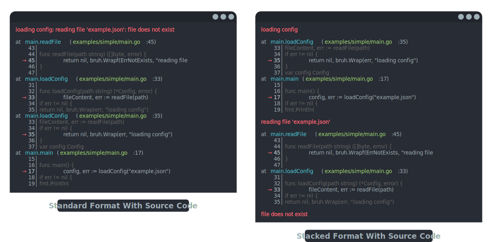

<a name="readme-top"></a>

[](https://pkg.go.dev/github.com/aisbergg/go-bruh/pkg/bruh)
[](https://goreportcard.com/report/github.com/aisbergg/go-bruh)
[](https://codecov.io/gh/aisbergg/go-bruh)
[](https://github.com/aisbergg/go-bruh/actions/workflows/codeql.yml)
[](https://pkg.go.dev/github.com/aisbergg/go-bruh)
[](https://www.linkedin.com/in/andre-lehmann-97408221a/)

<br />
<br />
<div align="center">
  <a href="https://github.com/aisbergg/go-bruh">
    
  </a>

  <h2 align="center"><b>bruh - Error Handling</b></h2>

  <p align="center">
    Having a bruh moment? No problem! Handle errors like a pro with <i>bruh</i> - the Go error handling library that simplifies error management and beautifies stack traces.
    <br />
    <br />
    <a href="https://pkg.go.dev/github.com/aisbergg/go-bruh/pkg/bruh">View Docs</a>
    ·
    <a href="https://github.com/aisbergg/go-bruh/issues">Report Bug</a>
    ·
    <a href="https://github.com/aisbergg/go-bruh/issues">Request Feature</a>
  </p>
</div>

> NOTICE: Version 1.2.0 is a major update and brings significant changes. See [here](#upgrade-to-version-120) for how to migrate to the new version.

<details open="open">
  <summary>Table of Contents</summary>

- [About](#about)
- [Installation](#installation)
- [Synopsis](#synopsis)
    - [Creating and Wrapping Errors](#creating-and-wrapping-errors)
    - [Creating Custom Errors](#creating-custom-errors)
    - [Formatting Errors](#formatting-errors)
        - [Built-in Formats](#built-in-formats)
            - [`BruhFormatter`](#bruhformatter)
            - [`BruhFancyFormatter(colored, sourced)`](#bruhfancyformattercolored-sourced)
            - [`BruhStackedFormatter`](#bruhstackedformatter)
            - [`BruhStackedFancyFormatter(colored, sourced, typed)`](#bruhstackedfancyformattercolored-sourced-typed)
            - [`GoPanicFormatter`](#gopanicformatter)
            - [`JavaStackTraceFormatter`](#javastacktraceformatter)
            - [`PythonTracebackFormatter`](#pythontracebackformatter)
        - [Custom Formats](#custom-formats)
- [Upgrade to Version 1.2.0](#upgrade-to-version-120)
- [Benchmark](#benchmark)
- [Contributing](#contributing)
- [License](#license)
- [Contact](#contact)
- [Acknowledgments](#acknowledgments)

</details>


## About

Having a bruh moment? Don't worry, _bruh_ is here to help! _bruh_ is a Go error handling library that makes it easy to deal with errors and print pretty stack traces. Simply create, wrap, and format your errors with all the details you need.

**Features:**

- Automatically includes stack traces in errors, compatible with the Go SDKs of [Sentry](https://sentry.io) and [BugSnag](https://www.bugsnag.com).
- Simplifies creating custom errors enriched with stack traces and optionally source code.
- Provides sleek error formatting by default, with support for custom formats that let you turn errors into JSON or any other format.
- Configurable depth of stack frames to capture.
- Better performance compared to other error libraries that support stack traces.



I like the idea of error handling as a form of storytelling as advocated in [this article](https://preslav.me/2023/04/14/golang-error-handling-is-a-form-of-storytelling/). I urge you to read it, but here is a short summary: If you put some effort in creating and wrapping your errors you can actually tell a readable story. A story about what went wrong and what your code was doing when the error occurred. Keep every part of the concatenated error message concise and descriptive. Use present tense and say what the code was attempting to do in that moment of time. Avoid words like "failed", "cannot", "won’t", etc. - it is clear to the reader of the log message that if it occurred, something did not happen. Here is an example: `getting user: connecting to the DB: connection refused`

Bruh, whats the deal with the name? Sure, it might be a teeny weeny bit overused and annoying, but still better than the next pun on "errors". Also, when I first saw that someone created a joke PR on the Linux kernel [exchanging "kernel panic" with "bruh moment"](https://github.com/torvalds/linux/pull/684) I chuckled and it got stuck with me. There you have it.

<p align="right"><a href="#readme-top"><b>back to top ⇧</b></a></p>


## Installation

```sh
go get github.com/aisbergg/go-bruh
```

<p align="right"><a href="#readme-top"><b>back to top ⇧</b></a></p>


## Synopsis

```go
package main

import (
	"fmt"

	"github.com/aisbergg/go-bruh/pkg/bruh"
)

func main() {
	// error creation
	err := bruh.New("unexpected end of file")
	// error wrapping
	err = bruh.Wrapf(err, "reading file '%s'", "example.txt")
	// using a custom error type
	err = WrapUserError(err, "12345", "retrieving user data")

	// error formatting
	fmt.Println(bruh.String(err))
	// using a different format
	fmt.Println(bruh.StringFormat(err, bruh.GoPanicFormatter))

	// testing for specific errors
	var userErr *UserError
	if bruh.As(err, &userErr) {
		fmt.Printf("User ID: %s\n", userErr.UserID)
	}
}

type UserError struct {
	bruh.Err
	UserID string
}

func WrapUserError(err error, userID, message string) *UserError {
	return &UserError{
		Err:    *bruh.WrapSkip(err, 1, message),
		UserID: userID,
	}
}
```

### Creating and Wrapping Errors

Creating new errors with stack traces is done by calling [`bruh.New(msg string)`](https://pkg.go.dev/github.com/aisbergg/go-bruh/pkg/bruh#New) or [`Errorf(format string, args ...any)`](https://pkg.go.dev/github.com/aisbergg/go-bruh/pkg/bruh#Errorf).

To wrap existing errors and add more context you can use [`Wrap(err error, msg string)`](https://pkg.go.dev/github.com/aisbergg/go-bruh/pkg/bruh#Wrap) or [`Wrapf(err error, format string, args ...any)`](https://pkg.go.dev/github.com/aisbergg/go-bruh/pkg/bruh#Wrapf).


```golang
package main

import (
	"fmt"
	"net/http"
	"os"
	"time"

	"github.com/aisbergg/go-bruh/pkg/bruh"
)

// define a global error; you can also create root errors with `bruh.New`
// elsewhere as needed
var ErrInternalServer = bruh.New("error internal server")

func main() {
	url := "https://foo-bar.local/resource/dog.jpg"
	if _, err := Get(url); err != nil {
		err = bruh.Wrap(err, "getting an image of a dog")
		fmt.Fprintf(os.Stderr, "%s\n", bruh.String(err))
		os.Exit(1)
	}
}

func Get(url string) (*http.Response, error) {
	client := http.Client{Timeout: 300 * time.Millisecond}
	res, err := client.Get(url)
	if err == nil && res.StatusCode != http.StatusOK {
		// create a root error with a formatted message
		err = bruh.Errorf("GET \"%s\" failed with status code %d", url, res.StatusCode)
	}
	if err != nil {
		// wrap the error and add context
		return nil, bruh.Wrap(err, "requesting resource")
	}
	return res, nil
}
```

Outputs:

```plaintext
getting an image of a dog: requesting remote resource: Get "https://foo-bar.local/resource/dog.jpg": context deadline exceeded (Client.Timeout exceeded while awaiting headers)
    at main.Get (.../examples/readme/create_and_wrap/main.go:36)
    at main.main (.../examples/readme/create_and_wrap/main.go:18)
    at main.main (.../examples/readme/create_and_wrap/main.go:19)
```

<p align="right"><a href="#readme-top"><b>back to top ⇧</b></a></p>


### Creating Custom Errors

Custom errors can be created based on the bruh standard error leveraging struct embedding. The custom error will "inherit" the properties of the bruh error and automatically be decorated with a stack trace. Here is an example:

```go
package main

import (
	"fmt"
	"time"

	"github.com/aisbergg/go-bruh/pkg/bruh"
)

func main() {
	err := fmt.Errorf("external error")
	err = Wrapf(err, "%s, what a day", "bruh")
	if terr, ok := err.(*TimestampedError); ok {
		fmt.Printf("%s: %s\n", terr.Timestamp().Format(time.RFC3339), terr.Error())
	}
}

// TimestampedError represents the custom error. It embeds [bruh.Err]
// and "inherits" its properties. This way, you can create your own custom types
// and add more properties as needed.
type TimestampedError struct {
	bruh.Err
	timestamp time.Time
}

// Wrapf creates the custom error. It initializes the embedded bruh error using
// the `WrapfSkip` function. For each standard error creation function, there is
// a corresponding `Skip` variant. These ensure that the current function is
// excluded from the stack trace, so it does not appear in the error output.
func Wrapf(err error, format string, args ...any) error {
    if err == nil {
		return nil
	}
	return &TimestampedError{
		// skip is required to skip the current function and thus exclude this
		// function from the stack trace
		Error:     *bruh.WrapfSkip(err, 1, format, args...),
		timestamp: time.Now(),
	}
}

func (te *TimestampedError) Timestamp() time.Time {
	return te.timestamp
}
```

> You can find a full example here [timestamped_error.go](examples/custom_error/timestamped_error.go)

<p align="right"><a href="#readme-top"><b>back to top ⇧</b></a></p>


### Formatting Errors

To format errors as a string you can use the built-in formats provide custom ones. No matter what format you use, the basic usage is as follows:

```go
package main

import (
	"fmt"

	"github.com/aisbergg/go-bruh/pkg/bruh"
)

func main() {
	err := foo()

	// message only
	f := bruh.Message(err)
    // or simply
    f = err.Error()

	// with trace (default format)
	f = bruh.String(err)

	// with custom format
	f = bruh.StringFormat(err, bruh.BruhStackedFormatter)

	fmt.Println(f)
}

// some external error
var extErr = fmt.Errorf("external")

func foo() error {
	return bruh.Wrapf(bar(), "foo")
}

func bar() error {
	return bruh.Wrapf(extErr, "bar")
}
```

Outputs:

```plaintext
foo
    at main.foo (.../examples/readme/format/main.go:30)
    at main.main (.../examples/readme/format/main.go:10)
bar
    at main.bar (.../examples/readme/format/main.go:34)
    at main.foo (.../examples/readme/format/main.go:30)
external
```

#### Built-in Formats

Following formats are built-in:

##### `BruhFormatter`

```plaintext
configuring application: decoding data: reading file 'example.json': unexpected EOF
    at main.readFile (readme/formats_showcase/main.go:67)
    at main.decodingData (readme/formats_showcase/main.go:57)
    at main.decodingData (readme/formats_showcase/main.go:59)
    at main.configure (readme/formats_showcase/main.go:49)
    at main.configure (readme/formats_showcase/main.go:51)
    at main.main (readme/formats_showcase/main.go:14)
```

##### `BruhFancyFormatter(colored, sourced)`

A variant of `bruh.BruhFormatter` that can include a source code snippet for each error location and add ANSI coloring.

Source code snippets can only be included, if the source code is available in the current working directory. If the source code is not available, the formatter will fall back to the default `bruh.BruhFormatter`.

```plaintext
configuring application: decoding data: reading file 'example.json': unexpected EOF

at main.readFile (readme/formats_showcase/main.go:67)
    65│    err := io.ErrUnexpectedEOF
    66│    if err != nil {
  → 67│        return bruh.Wrapf(err, "reading file '%s'", path)
    68│    }
    69│    return nil
at main.decodingData (readme/formats_showcase/main.go:57)
    55│
    56│    func decodingData() error {
  → 57│        err := readFile("example.json")
    58│        if err != nil {
    59│            return bruh.Wrap(err, "decoding data")
at main.decodingData (readme/formats_showcase/main.go:59)
    57│    err := readFile("example.json")
    58│    if err != nil {
  → 59│        return bruh.Wrap(err, "decoding data")
    60│    }
    61│    return nil
at main.configure (readme/formats_showcase/main.go:49)
    47│
    48│    func configure() error {
  → 49│        err := decodingData()
    50│        if err != nil {
    51│            return bruh.Wrap(err, "configuring application")
at main.configure (readme/formats_showcase/main.go:51)
    49│    err := decodingData()
    50│    if err != nil {
  → 51│        return bruh.Wrap(err, "configuring application")
    52│    }
    53│    return nil
at main.main (readme/formats_showcase/main.go:14)
    12│
    13│    func main() {
  → 14│        err := configure()
    15│
    16│        formats := []bruh.Formatter{
```

##### `BruhStackedFormatter`

```plaintext
configuring application
    at main.configure (readme/formats_showcase/main.go:51)
    at main.main (readme/formats_showcase/main.go:14)
decoding data
    at main.decodingData (readme/formats_showcase/main.go:59)
    at main.configure (readme/formats_showcase/main.go:49)
reading file 'example.json'
    at main.readFile (readme/formats_showcase/main.go:67)
    at main.decodingData (readme/formats_showcase/main.go:57)
unexpected EOF
```

##### `BruhStackedFancyFormatter(colored, sourced, typed)`

A variant of `bruh.BruhStackedFormatter` that can include a source code snippet for each error location, display error type information, and add ANSI coloring.

Source code snippets can only be included, if the source code is available in the current working directory. If the source code is not available, the formatter will fall back to the default `bruh.BruhFormatter`.

```plaintext
configuring application

at main.configure (readme/formats_showcase/main.go:51)
    49│    err := decodingData()
    50│    if err != nil {
  → 51│        return bruh.Wrap(err, "configuring application")
    52│    }
    53│    return nil
at main.main (readme/formats_showcase/main.go:14)
    12│
    13│    func main() {
  → 14│        err := configure()
    15│
    16│        formats := []bruh.Formatter{
decoding data

at main.decodingData (readme/formats_showcase/main.go:59)
    57│    err := readFile("example.json")
    58│    if err != nil {
  → 59│        return bruh.Wrap(err, "decoding data")
    60│    }
    61│    return nil
at main.configure (readme/formats_showcase/main.go:49)
    47│
    48│    func configure() error {
  → 49│        err := decodingData()
    50│        if err != nil {
    51│            return bruh.Wrap(err, "configuring application")
reading file 'example.json'

at main.readFile (readme/formats_showcase/main.go:67)
    65│    err := io.ErrUnexpectedEOF
    66│    if err != nil {
  → 67│        return bruh.Wrapf(err, "reading file '%s'", path)
    68│    }
    69│    return nil
at main.decodingData (readme/formats_showcase/main.go:57)
    55│
    56│    func decodingData() error {
  → 57│        err := readFile("example.json")
    58│        if err != nil {
    59│            return bruh.Wrap(err, "decoding data")
unexpected EOF
```

##### `GoPanicFormatter`

```plaintext
configuring application: decoding data: reading file 'example.json': unexpected EOF

main.readFile()
	readme/formats_showcase/main.go:67 +0x4b33a5
main.decodingData()
	readme/formats_showcase/main.go:57 +0x4b3342
main.decodingData()
	readme/formats_showcase/main.go:59 +0x4b33c5
main.configure()
	readme/formats_showcase/main.go:49 +0x4b32d2
main.configure()
	readme/formats_showcase/main.go:51 +0x4b32ee
main.main()
	readme/formats_showcase/main.go:14 +0x4b2f7e
```

##### `JavaStackTraceFormatter`

```plaintext
*bruh.Err: configuring application
    at main.configure (readme/formats_showcase/main.go:51)
    at main.main (readme/formats_showcase/main.go:14)
Caused by: *bruh.Err: decoding data
    at main.decodingData (readme/formats_showcase/main.go:59)
    at main.configure (readme/formats_showcase/main.go:49)
Caused by: *bruh.Err: reading file 'example.json'
    at main.readFile (readme/formats_showcase/main.go:67)
    at main.decodingData (readme/formats_showcase/main.go:57)
Caused by: *errors.errorString: unexpected EOF
```

##### `PythonTracebackFormatter`

```plaintext
*errors.errorString: unexpected EOF

The above exception was the direct cause of the following exception:

Traceback (most recent call last):
  File "readme/formats_showcase/main.go", line 57, in main.decodingData
  File "readme/formats_showcase/main.go", line 67, in main.readFile
*bruh.Err: reading file 'example.json'

The above exception was the direct cause of the following exception:

Traceback (most recent call last):
  File "readme/formats_showcase/main.go", line 49, in main.configure
  File "readme/formats_showcase/main.go", line 59, in main.decodingData
*bruh.Err: decoding data

The above exception was the direct cause of the following exception:

Traceback (most recent call last):
  File "readme/formats_showcase/main.go", line 14, in main.main
  File "readme/formats_showcase/main.go", line 51, in main.configure
*bruh.Err: configuring application
```

<p align="right"><a href="#readme-top"><b>back to top ⇧</b></a></p>


#### Custom Formats

If you are not satisfied with the built-in formats you can easily create your own. Check the [json example](examples/custom_format/json.go) on how to accomplish that.

<p align="right"><a href="#readme-top"><b>back to top ⇧</b></a></p>


## Upgrade to Version 1.2.0

Version 1.2.0 is a major overhaul and contains breaking changes. In order to avoid issues with Go`s versioning behavior for major versions, I decided to keep the v1 tag. From here on out I consider the library as final and stable. The API is not expected to change much, but I will continue to improve the library and might add new features.

Here is what changed from v1.1.0 to v1.2.0:

- Renamed `bruh.TraceableError` to `bruh.Err`
- Renamed `bruh.ToString` to `bruh.String` and gave it a new signature: `func String(err error) string`
- Renamed `bruh.ToCustomString` to `bruh.StringFormat` and gave it a new signature: `func StringFormat(err error, f Formatter, unpackAll ...bool) string`
- New signature for `bruh.Formatter`: `type Formatter func(b []byte, unpacker *Unpacker) []byte`
- Removed `*bruh.TraceableError.FullStack()`, now it is just `*bruh.Err.Stack()`
- Moved package `github.com/aisbergg/go-bruh/pkg/bruh/ctxerror` to `github.com/aisbergg/go-bruh/pkg/ctxerror`
- Renamed `ctxerror.ContextableError` to `ctxerror.Err`

<p align="right"><a href="#readme-top"><b>back to top ⇧</b></a></p>


## Benchmark

Inside the `benchmark` directory reside some comparable benchmarks that allow some performance comparison of bruh with other error handling libraries. The benchmarks can be executed by running `make bench`. Here are my results:

```
cpu: Intel(R) Core(TM) i7-8550U CPU @ 1.80GHz
BenchmarkCompareWrap/pkg=bruh/layers=1-4                 2931866               406.3 ns/op     320 B/op          1 allocs/op
BenchmarkCompareWrap/pkg=pkgerrors/layers=1-4            2636788               451.3 ns/op     304 B/op          3 allocs/op
BenchmarkCompareWrap/pkg=eris/layers=1-4                  597975              1738 ns/op     1208 B/op          10 allocs/op
BenchmarkCompareWrap/pkg=emperror/layers=1-4             1828514               660.0 ns/op     112 B/op          4 allocs/op
BenchmarkCompareWrap/pkg=bruh/layers=10-4                 210784              5307 ns/op     3200 B/op          10 allocs/op
BenchmarkCompareWrap/pkg=pkgerrors/layers=10-4            225253              5066 ns/op     3328 B/op          39 allocs/op
BenchmarkCompareWrap/pkg=eris/layers=10-4                  67748             17477 ns/op     9009 B/op          83 allocs/op
BenchmarkCompareWrap/pkg=emperror/layers=10-4             177994              5976 ns/op     1264 B/op          40 allocs/op
BenchmarkCompareWrap/pkg=bruh/layers=100-4                 28000             42837 ns/op    32000 B/op         100 allocs/op
BenchmarkCompareWrap/pkg=pkgerrors/layers=100-4            23580             50853 ns/op    33568 B/op         399 allocs/op
BenchmarkCompareWrap/pkg=eris/layers=100-4                  5780            175240 ns/op    86783 B/op         803 allocs/op
BenchmarkCompareWrap/pkg=emperror/layers=100-4             22329             52791 ns/op    12784 B/op         400 allocs/op
BenchmarkCompareFormatMessageOnly/pkg=bruh/layers=1-4           24783986                45.29 ns/op             80 B/op          1 allocs/op
BenchmarkCompareFormatMessageOnly/pkg=pkgerrors/layers=1-4      10700432               102.2 ns/op               5 B/op          1 allocs/op
BenchmarkCompareFormatMessageOnly/pkg=eris/layers=1-4            1910074               632.3 ns/op             528 B/op          4 allocs/op
BenchmarkCompareFormatMessageOnly/pkg=emperror/layers=1-4       10910574               102.5 ns/op               5 B/op          1 allocs/op
BenchmarkCompareFormatMessageOnly/pkg=bruh/layers=10-4           4269223               287.1 ns/op             896 B/op          1 allocs/op
BenchmarkCompareFormatMessageOnly/pkg=pkgerrors/layers=10-4      2039810               561.7 ns/op             432 B/op         10 allocs/op
BenchmarkCompareFormatMessageOnly/pkg=eris/layers=10-4            249972              4794 ns/op      6240 B/op         49 allocs/op
BenchmarkCompareFormatMessageOnly/pkg=emperror/layers=10-4       2091418               568.6 ns/op             432 B/op         10 allocs/op
BenchmarkCompareFormatMessageOnly/pkg=bruh/layers=100-4           408442              2800 ns/op      8192 B/op          1 allocs/op
BenchmarkCompareFormatMessageOnly/pkg=pkgerrors/layers=100-4      117104             10425 ns/op     32373 B/op        100 allocs/op
BenchmarkCompareFormatMessageOnly/pkg=eris/layers=100-4            10000            101587 ns/op    360722 B/op        499 allocs/op
BenchmarkCompareFormatMessageOnly/pkg=emperror/layers=100-4       113103             10451 ns/op     32373 B/op        100 allocs/op
BenchmarkCompareFormatTrace/pkg=bruh/layers=1-4                   803347              1452 ns/op       768 B/op          1 allocs/op
BenchmarkCompareFormatTrace/pkg=bruh-stacked/layers=1-4           823174              1268 ns/op       768 B/op          1 allocs/op
BenchmarkCompareFormatTrace/pkg=pkgerrors/layers=1-4              484231              2231 ns/op       584 B/op         10 allocs/op
BenchmarkCompareFormatTrace/pkg=eris/layers=1-4                   445532              2458 ns/op      2136 B/op         30 allocs/op
BenchmarkCompareFormatTrace/pkg=emperror/layers=1-4               488632              2283 ns/op       584 B/op         10 allocs/op
BenchmarkCompareFormatTrace/pkg=bruh/layers=10-4                  264859              4417 ns/op      1793 B/op          1 allocs/op
BenchmarkCompareFormatTrace/pkg=bruh-stacked/layers=10-4           96597             12283 ns/op      3458 B/op          1 allocs/op
BenchmarkCompareFormatTrace/pkg=pkgerrors/layers=10-4              42316             27817 ns/op      6106 B/op         91 allocs/op
BenchmarkCompareFormatTrace/pkg=eris/layers=10-4                   96130             12664 ns/op     18869 B/op        147 allocs/op
BenchmarkCompareFormatTrace/pkg=emperror/layers=10-4               48303             24219 ns/op      6107 B/op         91 allocs/op
BenchmarkCompareFormatTrace/pkg=bruh/layers=100-4                  44437             26612 ns/op      9480 B/op          1 allocs/op
BenchmarkCompareFormatTrace/pkg=bruh-stacked/layers=100-4           8840            123119 ns/op     28709 B/op          1 allocs/op
BenchmarkCompareFormatTrace/pkg=pkgerrors/layers=100-4              2577            466341 ns/op     64713 B/op        901 allocs/op
BenchmarkCompareFormatTrace/pkg=eris/layers=100-4                   4886            256388 ns/op   1015404 B/op       1228 allocs/op
BenchmarkCompareFormatTrace/pkg=emperror/layers=100-4               2780            422235 ns/op     64771 B/op        901 allocs/op
```

<p align="right"><a href="#readme-top"><b>back to top ⇧</b></a></p>


## Contributing

If you have any suggestions, want to file a bug report or want to contribute to this project in some other way, please read the [contribution guideline](CONTRIBUTING.md).

And don't forget to give this project a star 🌟! Thanks again!

<p align="right"><a href="#readme-top"><b>back to top ⇧</b></a></p>


## License

Distributed under the MIT License. See `LICENSE` for more information.

<p align="right"><a href="#readme-top"><b>back to top ⇧</b></a></p>


## Contact

André Lehmann

- Email: aisberg@posteo.de
- [GitHub](https://github.com/aisbergg)
- [LinkedIn](https://www.linkedin.com/in/andre-lehmann-97408221a/)

<p align="right"><a href="#readme-top"><b>back to top ⇧</b></a></p>


## Acknowledgments

_bruh_ was originally inspired by [eris](https://github.com/rotisserie/eris), so shout out to the maintainers of eris!

The logo is a derivative of the [logo](https://github.com/rfyiamcool/golang_logo/blob/master/svg/golang_3.svg) by [rfyiamcool](https://github.com/rfyiamcool). Sorry rfyiamcool that I butchered your gopher.

<p align="right"><a href="#readme-top"><b>back to top ⇧</b></a></p>
