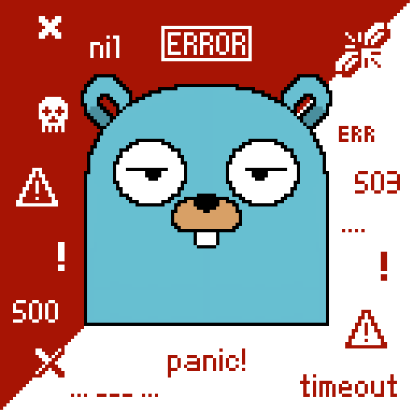
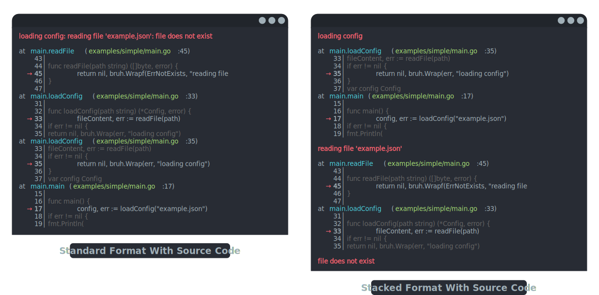

<a name="readme-top"></a>

[](https://pkg.go.dev/github.com/aisbergg/go-bruh/pkg/bruh)
[](https://codecov.io/gh/aisbergg/go-bruh)
[](https://github.com/aisbergg/go-bruh/actions/workflows/codeql.yml)
[](https://pkg.go.dev/github.com/aisbergg/go-bruh)
[](https://www.linkedin.com/in/andre-lehmann-97408221a/)

<br />
<br />
<div align="center">
  <a href="https://github.com/aisbergg/go-bruh">
    
  </a>

  <h2 align="center"><b>bruh - Error Handling</b></h2>

  <p align="center">
    Having a bruh moment? No problem! Handle errors like a pro with <i>bruh</i> - the Go error handling library that simplifies error management and beautifies stack traces.
    <br />
    <br />
    <a href="https://pkg.go.dev/github.com/aisbergg/go-bruh/pkg/bruh">View Docs</a>
    ·
    <a href="https://github.com/aisbergg/go-bruh/issues">Report Bug</a>
    ·
    <a href="https://github.com/aisbergg/go-bruh/issues">Request Feature</a>
  </p>
</div>

<details open="open">
  <summary>Table of Contents</summary>

- [About](#about)
- [Installation](#installation)
- [Usage](#usage)
    - [Creating and Wrapping Errors](#creating-and-wrapping-errors)
    - [Creating from Panic](#creating-from-panic)
    - [Creating Custom Errors](#creating-custom-errors)
    - [Formatting Errors](#formatting-errors)
        - [Built-in Formats](#built-in-formats)
            - [`BruhFormatter`](#bruhformatter)
            - [`BruhFancyFormatter(colored, sourced)`](#bruhfancyformattercolored-sourced)
            - [`BruhStackedFormatter`](#bruhstackedformatter)
            - [`BruhStackedFancyFormatter(colored, sourced, typed)`](#bruhstackedfancyformattercolored-sourced-typed)
            - [`GoPanicFormatter`](#gopanicformatter)
            - [`JavaStackTraceFormatter`](#javastacktraceformatter)
            - [`PythonTracebackFormatter`](#pythontracebackformatter)
        - [Custom Formats](#custom-formats)
    - [Stack Depth](#stack-depth)
    - [Stacktrace Without Bruh](#stacktrace-without-bruh)
    - [Integrations](#integrations)
        - [Sentry](#sentry)
        - [OTEL](#otel)
        - [slog](#slog)
    - [Multi Error](#multi-error)
    - [Context Error](#context-error)
- [Benchmark](#benchmark)
- [Contributing](#contributing)
- [License](#license)
- [Contact](#contact)

</details>

## About

Having a bruh moment? Don't worry, _bruh_ is here to help! _bruh_ is a Go error handling library that makes it easy to deal with errors and print pretty stack traces. Simply create, wrap, and format your errors with all the details you need.

**Features:**

- Captures stack traces by default and is compatible with [Sentry](https://sentry.io) and [BugSnag](https://www.bugsnag.com).
- Supports sleek, flexible formatting with built-in formatters plus custom formatters (for example JSON output).
- Integrates with `slog` via [`ctxslog`](#slog) for structured logging of error context and tags.
- Integrates with OpenTelemetry via [`ctxotel`](#otel) for recording rich error metadata and stack traces on spans.
- Offers better performance compared to other error libraries that support stack traces.



I like the idea of error handling as a form of storytelling as advocated in [this article](https://preslav.me/2023/04/14/golang-error-handling-is-a-form-of-storytelling/). I urge you to read it, but here is a short summary: If you put some effort in creating and wrapping your errors you can actually tell a readable story. A story about what went wrong and what your code was doing when the error occurred. Keep every part of the concatenated error message concise and descriptive. Use present tense and say what the code was attempting to do in that moment of time. Avoid words like "failed", "cannot", "won’t", etc. - it is clear to the reader of the log message that if it occurred, something did not happen. Here is an example: `getting user: connecting to the DB: connection refused`

Bruh, whats the deal with the name? Sure, it might be a teeny weeny bit overused and annoying, but still better than the next pun on "errors". Also, when I first saw that someone created a joke PR on the Linux kernel [exchanging "kernel panic" with "bruh moment"](https://web.archive.org/web/20260115134912/https://github.com/torvalds/linux/pull/684) I chuckled and it got stuck with me. There you have it.

<p align="right"><a href="#readme-top"><b>back to top ⇧</b></a></p>

## Installation

```sh
go get github.com/aisbergg/go-bruh
```

<p align="right"><a href="#readme-top"><b>back to top ⇧</b></a></p>

## Usage

**Synopsis:**

```go
package main

import (
	"fmt"

	"github.com/aisbergg/go-bruh/pkg/bruh"
)

func main() {
	// error creation
	err := bruh.New("unexpected end of file")
	// error wrapping
	err = bruh.Wrapf(err, "reading file '%s'", "example.txt")
	// using a custom error type
	err = WrapUserError(err, "12345", "retrieving user data")
	// recovering a panic
	err = RecoverFromPanic()

	// error formatting
	fmt.Println(bruh.String(err))
	// using a different format
	fmt.Println(bruh.StringFormat(err, bruh.GoPanicFormatter))

	// testing for specific errors
	var userErr *UserError
	if bruh.As(err, &userErr) {
		fmt.Printf("User ID: %s\n", userErr.UserID)
	}
}

type UserError struct {
	bruh.Err
	UserID string
}

func WrapUserError(err error, userID, message string) *UserError {
	return &UserError{
		Err:    *bruh.WrapSkip(err, 1, message),
		UserID: userID,
	}
}

func RecoverFromPanic() (err error) {
	defer func() {
		if r := recover(); r != nil {
			// extracts the message and stack trace from the panic
			err = bruh.NewFromPanic(r)
		}
	}()
	panic("something went wrong")
}
```

### Creating and Wrapping Errors

Creating new errors with stack traces is done by calling [`bruh.New(msg string)`](https://pkg.go.dev/github.com/aisbergg/go-bruh/pkg/bruh#New) or [`Errorf(format string, args ...any)`](https://pkg.go.dev/github.com/aisbergg/go-bruh/pkg/bruh#Errorf).

To wrap existing errors and add more context you can use [`Wrap(err error, msg string)`](https://pkg.go.dev/github.com/aisbergg/go-bruh/pkg/bruh#Wrap) or [`Wrapf(err error, format string, args ...any)`](https://pkg.go.dev/github.com/aisbergg/go-bruh/pkg/bruh#Wrapf).

```golang
package main

import (
	"fmt"
	"net/http"
	"os"
	"time"

	"github.com/aisbergg/go-bruh/pkg/bruh"
)

// define a global error; you can also create root errors with `bruh.New`
// elsewhere as needed
var ErrInternalServer = bruh.New("error internal server")

func main() {
	url := "https://foo-bar.local/resource/dog.jpg"
	if _, err := Get(url); err != nil {
		err = bruh.Wrap(err, "getting an image of a dog")
		fmt.Fprintf(os.Stderr, "%s\n", bruh.String(err))
		os.Exit(1)
	}
}

func Get(url string) (*http.Response, error) {
	client := http.Client{Timeout: 300 * time.Millisecond}
	res, err := client.Get(url)
	if err == nil && res.StatusCode != http.StatusOK {
		// create a root error with a formatted message
		err = bruh.Errorf("GET \"%s\" failed with status code %d", url, res.StatusCode)
	}
	if err != nil {
		// wrap the error and add context
		return nil, bruh.Wrap(err, "requesting resource")
	}
	return res, nil
}
```

Output:

```plaintext
getting an image of a dog: requesting remote resource: Get "https://foo-bar.local/resource/dog.jpg": context deadline exceeded (Client.Timeout exceeded while awaiting headers)
    at main.Get (.../examples/readme/create_and_wrap/main.go:36)
    at main.main (.../examples/readme/create_and_wrap/main.go:18)
    at main.main (.../examples/readme/create_and_wrap/main.go:19)
```

<p align="right"><a href="#readme-top"><b>back to top ⇧</b></a></p>

### Creating from Panic

Errors with stack traces can also be created from a panic by calling recover and passing its value to [`bruh.NewFromPanic(panicValue any)`](https://pkg.go.dev/github.com/aisbergg/go-bruh/pkg/bruh#NewFromPanic).

```golang
package main

import (
	"fmt"

	"github.com/aisbergg/go-bruh/pkg/bruh"
)

func main() {
	defer func() {
		if r := recover(); r != nil {
			err := bruh.NewFromPanic(r)
			fmt.Printf("%s\n", bruh.StringFormat(err, bruh.BruhFormatter))
		}
	}()

	fmt.Printf("result: %d\n", Divide(10, 0))

	// this will never be reached because the panic will be caught by the defer
	fmt.Println("done")
}

func Divide(a, b int) int {
	if b == 0 {
		panic("division by zero")
	}
	return a / b
}
```

Output:

```plaintext
division by zero
    at main.Divide (.../examples/readme/create_from_panic/main.go:25)
    at main.main (.../examples/readme/create_from_panic/main.go:17)
```

<p align="right"><a href="#readme-top"><b>back to top ⇧</b></a></p>

### Creating Custom Errors

Custom errors can be created based on the bruh standard error leveraging struct embedding. The custom error will "inherit" the properties of the bruh error and automatically be decorated with a stack trace. Here is an example:

```go
package main

import (
	"fmt"
	"time"

	"github.com/aisbergg/go-bruh/pkg/bruh"
)

func main() {
	err := fmt.Errorf("external error")
	err = Wrapf(err, "%s, what a day", "bruh")
	if terr, ok := err.(*TimestampedError); ok {
		fmt.Printf("%s: %s\n", terr.Timestamp().Format(time.RFC3339), terr.Error())
	}
}

// TimestampedError represents the custom error. It embeds [bruh.Err]
// and "inherits" its properties. This way, you can create your own custom types
// and add more properties as needed.
type TimestampedError struct {
	bruh.Err
	timestamp time.Time
}

// Wrapf creates the custom error. It initializes the embedded bruh error using
// the `WrapfSkip` function. For each standard error creation function, there is
// a corresponding `Skip` variant. These ensure that the current function is
// excluded from the stack trace, so it does not appear in the error output.
func Wrapf(err error, format string, args ...any) error {
    if err == nil {
		return nil
	}
	return &TimestampedError{
		// skip is required to skip the current function and thus exclude this
		// function from the stack trace
		Error:     *bruh.WrapfSkip(err, 1, format, args...),
		timestamp: time.Now(),
	}
}

func (te *TimestampedError) Timestamp() time.Time {
	return te.timestamp
}
```

> You can find a full example here [timestamped_error.go](examples/custom_error/timestamped_error.go)

<p align="right"><a href="#readme-top"><b>back to top ⇧</b></a></p>

### Formatting Errors

To format errors as a string you can use the built-in formats provide custom ones. No matter what format you use, the basic usage is as follows:

```go
package main

import (
	"fmt"

	"github.com/aisbergg/go-bruh/pkg/bruh"
)

func main() {
	err := foo()

	// message only
	f := bruh.Message(err)
    // or simply
    f = err.Error()

	// with trace (default format)
	f = bruh.String(err)

	// with custom format
	f = bruh.StringFormat(err, bruh.BruhStackedFormatter)

	fmt.Println(f)
}

// some external error
var extErr = fmt.Errorf("external")

func foo() error {
	return bruh.Wrapf(bar(), "foo")
}

func bar() error {
	return bruh.Wrapf(extErr, "bar")
}
```

Output:

```plaintext
foo
    at main.foo (.../examples/readme/format/main.go:30)
    at main.main (.../examples/readme/format/main.go:10)
bar
    at main.bar (.../examples/readme/format/main.go:34)
    at main.foo (.../examples/readme/format/main.go:30)
external
```

#### Built-in Formats

Following formats are built-in:

##### `BruhFormatter`

```plaintext
configuring application: decoding data: reading file 'example.json': unexpected EOF
    at main.readFile (readme/formats_showcase/main.go:67)
    at main.decodingData (readme/formats_showcase/main.go:57)
    at main.decodingData (readme/formats_showcase/main.go:59)
    at main.configure (readme/formats_showcase/main.go:49)
    at main.configure (readme/formats_showcase/main.go:51)
    at main.main (readme/formats_showcase/main.go:14)
```

##### `BruhFancyFormatter(colored, sourced)`

A variant of `bruh.BruhFormatter` that can include a source code snippet for each error location and add ANSI coloring.

Source code snippets can only be included, if the source code is available in the current working directory. If the source code is not available, the formatter will fall back to the default `bruh.BruhFormatter`.

```plaintext
configuring application: decoding data: reading file 'example.json': unexpected EOF

at main.readFile (readme/formats_showcase/main.go:67)
    65│    err := io.ErrUnexpectedEOF
    66│    if err != nil {
  → 67│        return bruh.Wrapf(err, "reading file '%s'", path)
    68│    }
    69│    return nil
at main.decodingData (readme/formats_showcase/main.go:57)
    55│
    56│    func decodingData() error {
  → 57│        err := readFile("example.json")
    58│        if err != nil {
    59│            return bruh.Wrap(err, "decoding data")
at main.decodingData (readme/formats_showcase/main.go:59)
    57│    err := readFile("example.json")
    58│    if err != nil {
  → 59│        return bruh.Wrap(err, "decoding data")
    60│    }
    61│    return nil
at main.configure (readme/formats_showcase/main.go:49)
    47│
    48│    func configure() error {
  → 49│        err := decodingData()
    50│        if err != nil {
    51│            return bruh.Wrap(err, "configuring application")
at main.configure (readme/formats_showcase/main.go:51)
    49│    err := decodingData()
    50│    if err != nil {
  → 51│        return bruh.Wrap(err, "configuring application")
    52│    }
    53│    return nil
at main.main (readme/formats_showcase/main.go:14)
    12│
    13│    func main() {
  → 14│        err := configure()
    15│
    16│        formats := []bruh.Formatter{
```

##### `BruhStackedFormatter`

```plaintext
configuring application
    at main.configure (readme/formats_showcase/main.go:51)
    at main.main (readme/formats_showcase/main.go:14)
decoding data
    at main.decodingData (readme/formats_showcase/main.go:59)
    at main.configure (readme/formats_showcase/main.go:49)
reading file 'example.json'
    at main.readFile (readme/formats_showcase/main.go:67)
    at main.decodingData (readme/formats_showcase/main.go:57)
unexpected EOF
```

##### `BruhStackedFancyFormatter(colored, sourced, typed)`

A variant of `bruh.BruhStackedFormatter` that can include a source code snippet for each error location, display error type information, and add ANSI coloring.

Source code snippets can only be included, if the source code is available in the current working directory. If the source code is not available, the formatter will fall back to the default `bruh.BruhFormatter`.

```plaintext
configuring application

at main.configure (readme/formats_showcase/main.go:51)
    49│    err := decodingData()
    50│    if err != nil {
  → 51│        return bruh.Wrap(err, "configuring application")
    52│    }
    53│    return nil
at main.main (readme/formats_showcase/main.go:14)
    12│
    13│    func main() {
  → 14│        err := configure()
    15│
    16│        formats := []bruh.Formatter{
decoding data

at main.decodingData (readme/formats_showcase/main.go:59)
    57│    err := readFile("example.json")
    58│    if err != nil {
  → 59│        return bruh.Wrap(err, "decoding data")
    60│    }
    61│    return nil
at main.configure (readme/formats_showcase/main.go:49)
    47│
    48│    func configure() error {
  → 49│        err := decodingData()
    50│        if err != nil {
    51│            return bruh.Wrap(err, "configuring application")
reading file 'example.json'

at main.readFile (readme/formats_showcase/main.go:67)
    65│    err := io.ErrUnexpectedEOF
    66│    if err != nil {
  → 67│        return bruh.Wrapf(err, "reading file '%s'", path)
    68│    }
    69│    return nil
at main.decodingData (readme/formats_showcase/main.go:57)
    55│
    56│    func decodingData() error {
  → 57│        err := readFile("example.json")
    58│        if err != nil {
    59│            return bruh.Wrap(err, "decoding data")
unexpected EOF
```

##### `GoPanicFormatter`

```plaintext
configuring application: decoding data: reading file 'example.json': unexpected EOF

main.readFile()
	readme/formats_showcase/main.go:67 +0x4b33a5
main.decodingData()
	readme/formats_showcase/main.go:57 +0x4b3342
main.decodingData()
	readme/formats_showcase/main.go:59 +0x4b33c5
main.configure()
	readme/formats_showcase/main.go:49 +0x4b32d2
main.configure()
	readme/formats_showcase/main.go:51 +0x4b32ee
main.main()
	readme/formats_showcase/main.go:14 +0x4b2f7e
```

##### `JavaStackTraceFormatter`

```plaintext
*bruh.Err: configuring application
    at main.configure (readme/formats_showcase/main.go:51)
    at main.main (readme/formats_showcase/main.go:14)
Caused by: *bruh.Err: decoding data
    at main.decodingData (readme/formats_showcase/main.go:59)
    at main.configure (readme/formats_showcase/main.go:49)
Caused by: *bruh.Err: reading file 'example.json'
    at main.readFile (readme/formats_showcase/main.go:67)
    at main.decodingData (readme/formats_showcase/main.go:57)
Caused by: *errors.errorString: unexpected EOF
```

##### `PythonTracebackFormatter`

```plaintext
*errors.errorString: unexpected EOF

The above exception was the direct cause of the following exception:

Traceback (most recent call last):
  File "readme/formats_showcase/main.go", line 57, in main.decodingData
  File "readme/formats_showcase/main.go", line 67, in main.readFile
*bruh.Err: reading file 'example.json'

The above exception was the direct cause of the following exception:

Traceback (most recent call last):
  File "readme/formats_showcase/main.go", line 49, in main.configure
  File "readme/formats_showcase/main.go", line 59, in main.decodingData
*bruh.Err: decoding data

The above exception was the direct cause of the following exception:

Traceback (most recent call last):
  File "readme/formats_showcase/main.go", line 14, in main.main
  File "readme/formats_showcase/main.go", line 51, in main.configure
*bruh.Err: configuring application
```

<p align="right"><a href="#readme-top"><b>back to top ⇧</b></a></p>

#### Custom Formats

If you are not satisfied with the built-in formats you can easily create your own. Check the [json example](examples/custom_format/json.go) on how to accomplish that.

<p align="right"><a href="#readme-top"><b>back to top ⇧</b></a></p>

### Stack Depth

For optimization purposes the size of the collected stack frames per error and stack frames per chain during serialization is limited. If there are more, the result will be truncated. If you experience that your full stack frames are incomplete, you may raise the limit. There are two knobs that you can tweak:

**MaxErrorStackDepth**

`MaxErrorStackDepth` defines the maximum number of stack frames to capture per error. It influences the number of bytes allocated per error. If a function call stack exceeds this depth, the excess frames are truncated. This is generally not an issue, as the library merges stack traces across the error chain during serialization. To ensure full stack trace reconstruction, wrap errors from deeply nested calls to maintain stack frame overlap.

Its size must be defined at compilation time and thus it can only be set via build tag. Following build tags are available:

- `bruh.maxerrorstackdepth6`
- `bruh.maxerrorstackdepth12`
- `bruh.maxerrorstackdepth24` (default)
- `bruh.maxerrorstackdepth32`
- `bruh.maxerrorstackdepth48`

Build like this:

```sh
go build -tags bruh.maxerrorstackdepth32 ...
```

**MaxChainStackDepth**

`MaxChainStackDepth` defines the maximum number of stack frames for an error chain. This limits the number of stack frames to be exported to an error catcher and also limits the output of serialization.

`MaxChainStackDepth` can be set at runtime. You can find an example [here](./examples/stack_depth/stack_depth.go). Execute it using the command:

```sh
go run -tags bruh.maxerrorstackdepth6  ./examples/stack_depth/
```

<p align="right"><a href="#readme-top"><b>back to top ⇧</b></a></p>

### Stacktrace Without Bruh

You don't have to import and use Bruh to enjoy a stack trace with your custom error. To attach a trace to an error of yours you simply can provide the `Callers() []uintptr` method, and return the program counters up to that error. `Callers` is recognized by Bruh and included in the stack trace when printed out. Here is an example:

```go
package main

import (
	"fmt"
	"runtime"

	"github.com/aisbergg/go-bruh/pkg/bruh"
)

type MyError struct {
	msg     string
	callers []uintptr
}

func New(msg string) error {
	callers := make([]uintptr, 32)
	return &MyError{
		msg:     msg,
		callers: callers[:runtime.Callers(1, callers)],
	}
}

func (e *MyError) Error() string {
	return e.msg
}

func (e *MyError) Callers() []uintptr {
	return e.callers
}

func main() {
	err := New("root error")
	err = bruh.Wrap(err, "wrapped")
	fmt.Println(bruh.StringFormat(err, bruh.BruhStackedFormatter))
}
```

Output:

```plaintext
wrapped
    at main.main (.../examples/without_bruh/main.go:33)
root error
    at main.New (.../examples/without_bruh/main.go:19)
    at main.main (.../examples/without_bruh/main.go:32)
```

<p align="right"><a href="#readme-top"><b>back to top ⇧</b></a></p>

### Integrations

#### Sentry

Bruh errors can easily be send to Sentry and compatible error trackers to capture the error message, stack and optional context metadata.

The basic `*bruh.Err` error carries an error message and the stack trace that are extracted by Sentry through `sentry.CaptureException(err)`. To add extra metadata to error chains and capture it with Sentry use the package [`ctxerror`](#context-error). Here is an example:

```go
package main

import (
	"flag"
	"fmt"
	"os"
	"time"

	"github.com/aisbergg/go-bruh/pkg/ctxerror"
	"github.com/getsentry/sentry-go"
)

var dsn string

func init() {
	flag.StringVar(&dsn, "dsn", "", "Sentry DSN for logging stack traces")
}

func initSentry() {
	flag.Parse()
	if dsn == "" {
		fmt.Println("missing Sentry DSN, use -dsn flag to set it")
		os.Exit(1)
	}

	if err := sentry.Init(sentry.ClientOptions{
		Dsn: dsn,
	}); err != nil {
		fmt.Printf("failed to initialize Sentry: %v\n", err)
		os.Exit(1)
	}
}

func main() {
	initSentry()
	defer sentry.Flush(5 * time.Second)

	err := ctxerror.New("something went wrong").
		SetContext("user", map[string]any{"id": "123", "name": "Alice"}).
		SetTag("module", "example")

	sentry.WithScope(func(scope *sentry.Scope) {
		// if any error context is available, add it to the Sentry scope
		scope.SetContexts(ctxerror.GetContext(err))
		scope.SetTags(ctxerror.GetTags(err))
		scope.SetLevel(sentry.LevelError)
		// Sentry extracts the stack trace from the error automatically
		sentry.CaptureException(err)
	})
}
```

For a more thorough example look at [`examples/sentry/sentry.go`](examples/sentry/sentry.go).

<p align="right"><a href="#readme-top"><b>back to top ⇧</b></a></p>

#### OTEL

Observability is key, so don't cheap out on it. To record an error with stack trace and extra metadata using OTEL you can do the following:

```go
import "github.com/aisbergg/go-bruh/pkg/ctxerror/ctxotel"

func recordError(span trace.Span, err error) {
	stackTrace := bruh.StringFormat(err, bruh.BruhStackedFancyFormatter(false, false, true))
	span.RecordError(
		err,
		trace.WithAttributes(attribute.String("exception.stacktrace", stackTrace)),
		trace.WithAttributes(ctxotel.AsAttributes(err)...),
	)
	span.SetStatus(codes.Error, err.Error())
}
```

You can find the full example in [./examples/otel/main.go](./examples/otel/main.go).

<p align="right"><a href="#readme-top"><b>back to top ⇧</b></a></p>

#### slog

`ctxerror` provides the means to attach metadata to error chains. This comes in handy for structured logging with `slog`:

```go
package main

import (
	"context"
	"log/slog"
	"os"

	"github.com/aisbergg/go-bruh/pkg/ctxerror"
	"github.com/aisbergg/go-bruh/pkg/ctxerror/ctxslog"
)

func main() {
	logger := slog.New(slog.NewTextHandler(os.Stdout, &slog.HandlerOptions{}))

	err := ctxerror.New("request failed").
		SetContext("user", map[string]any{"id": "u1"}).
		SetTag("env", "prod")

	// equivalent to logger.Error(...)
	logger.LogAttrs(
		context.Background(),
		slog.LevelError,
		"error occurred",
		ctxslog.AsAttributes(err)...,
	)
}
```

Output:

```plaintext
time=2026-06-08T20:36:38.169+02:00 level=ERROR msg="error occurred" error="request failed" user.id=u1 env=prod
```

<p align="right"><a href="#readme-top"><b>back to top ⇧</b></a></p>

### Multi Error

`multierror` is useful when an operation can fail for more than one reason and you want to return all issues at once.

**Typical use cases:**

- Validation pipelines (e.g. config, request payloads)
- Batch jobs where each item may fail independently
- Cleanup code that should try all steps and report all failures

**Usage:**

1. Create a collector with `multierror.New(...)`
2. Add errors with `Add(...)`
3. Return `ErrorOrNil()` so callers get `nil` when no errors were added

```go
package main

import (
	"errors"
	"fmt"
	"strings"

	"github.com/aisbergg/go-bruh/pkg/multierror"
)

func main() {
	err := validateUser("", -4, "not-an-email")
	if err != nil {
		fmt.Printf("%s\n", err)
	}
}

func validateUser(name string, age int, email string) error {
	me := multierror.New("validating user payload")

	if name == "" {
		me.Add(errors.New("name is required"))
	}
	if age < 0 {
		me.Add(fmt.Errorf("age must be >= 0, got %d", age))
	}
	if !strings.Contains(email, "@") {
		me.Add(fmt.Errorf("email %q is invalid", email))
	}

	return me.ErrorOrNil()
}
```

Output:

```plaintext
validating user payload
  #0: name is required
  #1: age must be >= 0, got -4
  #2: email "not-an-email" is invalid
```

You can find this full example here [main.go](examples/readme/multi_error/main.go).

<p align="right"><a href="#readme-top"><b>back to top ⇧</b></a></p>

### Context Error

`ctxerror` allows you to create error chains with structured metadata (context and tags). The data model matches Sentry's contexts/tags and can be uploaded to Sentry; see the [Sentry example](examples/sentry/sentry.go).

**Guidelines:**

- Use **context** for richer grouped data (e.g. request info, payload fragments)
- Use **tags** for small string key/value attributes (e.g. operation, region)

**Usage:**

1. Create or wrap an error with `ctxerror.New(...)` / `ctxerror.Wrap(...)`
2. Attach metadata with `SetContext(...)` and `AddTag(...)`
3. Read metadata with `ctxerror.GetContext(err)` and `ctxerror.GetTags(err)`

Custom errors can implement one or more of the following methods to provide metadata to the error chain. This metadata will then be included in the output of `ctxerror.GetContext(err)` and `ctxerror.GetTags(err)`.

```go
// populate caller-provided map with grouped context values
AppendContext(context map[string]map[string]any)
// or return context map
Context() map[string]map[string]any

// populate caller-provided map with string tags
AppendTags(tags map[string]string)
// or return map of tags
Tags() map[string]string
```

**Note:**

`ctxerror` stores context and tags per error chain (not by individual error) to reduce allocations. Context added at the top of a chain is visible to the whole chain. There is no real point of trying to extract context at a mid-level of the chain.

You have to be careful, when you want to create errors with context and use it across different chains (e.g. global error), you have to deliberately unshare it by calling `Unshare()` on it. See the example down below.

**Example:**

```go
package main

import (
	"fmt"

	"github.com/aisbergg/go-bruh/pkg/ctxerror"
)

func main() {
	err := saveOrder("ord_42", 0)
	if err != nil {
		fmt.Println(err.Error())

		tags := ctxerror.GetTags(err)
		ctx := ctxerror.GetContext(err)

		for k, v := range tags {
			fmt.Printf("tag %s=%s\n", k, v)
		}
		for k, v := range ctx {
			fmt.Printf("context %s=%v\n", k, v)
		}
	}

	// Custom errors can implement Context and Tags methods to provide context and tags to ctxerror. This allows you to integrate with existing error types without wrapping them in *ctxerror.Err.
	customErr := &CustomError1{msg: "custom error occurred"}
	err = ctxerror.Wrap(customErr, "operation failed").SetTag("op", "custom_op")
	fmt.Println(err.Error())
	fmt.Printf("tags: %v\n", ctxerror.GetTags(err))
	fmt.Printf("context: %v\n", ctxerror.GetContext(err))

	// Alternatively, custom errors can implement AppendContext and AppendTags for append-style population of context and tags.
	customErr2 := &CustomError2{msg: "another custom error"}
	err = ctxerror.Wrap(customErr2, "operation failed").SetTag("op", "custom_op_2")
	fmt.Println(err.Error())
	fmt.Printf("tags: %v\n", ctxerror.GetTags(err))
	fmt.Printf("context: %v\n", ctxerror.GetContext(err))
}

func saveOrder(orderID string, itemCount int) error {
	if err := validateOrder(itemCount); err != nil {
		return ctxerror.Wrap(err, "saving order").
			SetTag("op", "save_order").
			SetContext("order", map[string]any{"id": orderID, "items": itemCount})
	}
	return nil
}

func validateOrder(itemCount int) error {
	if itemCount <= 0 {
		return ctxerror.Wrap(GlobalErr, "validating order").
			SetContext("validation", map[string]any{"itemCount": itemCount, "min": 1})
	}
	return nil
}

// Global errors or errors that are shared among multiple error chains need to
// be unshared, which creates a private metadata copy for upstream errors.
var GlobalErr = ctxerror.New("global error").SetTag("locale", "de").Unshare()

// Custom Error with context ---------------------------------------------------

type CustomError1 struct {
	msg string
}

func (ce *CustomError1) Error() string {
	return ce.msg
}

// Context allows `ctxerror` to extract context from this error type.
func (ce *CustomError1) Context() map[string]map[string]any {
	return map[string]map[string]any{
		"req": {
			"trace_id": 1,
		},
	}
}

// Tags allows `ctxerror` to extract tags from this error type.
func (ce *CustomError1) Tags() map[string]string {
	return map[string]string{
		"kind": "custom",
	}
}

type CustomError2 struct {
	msg string
}

func (ce *CustomError2) Error() string {
	return ce.msg
}

// AppendContext implements append-style population of caller-provided context map.
func (ce *CustomError2) AppendContext(context map[string]map[string]any) {
	context["req"] = map[string]any{"trace_id": 1}
}

// AppendTags implements append-style population of caller-provided tags map.
func (ce *CustomError2) AppendTags(tags map[string]string) {
	tags["kind"] = "custom"
}
```

Output:

```plaintext
saving order: validating order: global error
tag locale=de
tag op=save_order
context validation=map[itemCount:0 min:1]
context order=map[id:ord_42 items:0]
operation failed: custom error occurred
tags: map[kind:custom op:custom_op]
context: map[req:map[trace_id:1]]
operation failed: another custom error
tags: map[kind:custom op:custom_op_2]
context: map[req:map[trace_id:1]]
```

<p align="right"><a href="#readme-top"><b>back to top ⇧</b></a></p>

## Benchmark

Inside the `benchmark` directory reside some comparable benchmarks that allow some performance comparison of bruh with other error handling libraries. The benchmarks can be executed by running `make bench`.

> Note: The results of BenchmarkCompareFormatMessageOnly are not really comparable anymore, because bruh caches the results and serves those in consecutive benchmark iterations.
> To make it a fair comparison again, I would need to initialize a new error instance on each iteration. To continue only measuring the message creation, I need to reset the benchmark timer, which then messes up the heuristic on the Go benchmark iteration count, resulting a very long benchmark execution. Stupid problem to solve, so I won't fix that now.

Here are my results:

```
cpu: Intel(R) Core(TM) i7-8550U CPU @ 1.80GHz
BenchmarkCompareWrap/pkg=bruh/layers=1-4                 2667423               439.4 ns/op           288 B/op          1 allocs/op
BenchmarkCompareWrap/pkg=pkgerrors/layers=1-4            2417271               484.6 ns/op           304 B/op          3 allocs/op
BenchmarkCompareWrap/pkg=eris/layers=1-4                  605578              1806 ns/op            1208 B/op         10 allocs/op
BenchmarkCompareWrap/pkg=emperror/layers=1-4             1631450               723.9 ns/op           112 B/op          4 allocs/op
BenchmarkCompareWrap/pkg=bruh/layers=10-4                 194449              5772 ns/op            2880 B/op         10 allocs/op
BenchmarkCompareWrap/pkg=pkgerrors/layers=10-4            195614              5941 ns/op            3328 B/op         39 allocs/op
BenchmarkCompareWrap/pkg=eris/layers=10-4                  56982             20471 ns/op            9009 B/op         83 allocs/op
BenchmarkCompareWrap/pkg=emperror/layers=10-4             166635              6799 ns/op            1264 B/op         40 allocs/op
BenchmarkCompareWrap/pkg=bruh/layers=100-4                 23958             49156 ns/op           28800 B/op        100 allocs/op
BenchmarkCompareWrap/pkg=pkgerrors/layers=100-4            19777             58276 ns/op           33568 B/op        399 allocs/op
BenchmarkCompareWrap/pkg=eris/layers=100-4                  5769            208951 ns/op           86784 B/op        803 allocs/op
BenchmarkCompareWrap/pkg=emperror/layers=100-4             19712             59467 ns/op           12784 B/op        400 allocs/op
BenchmarkCompareFormatMessageOnly/pkg=bruh/layers=1-4           261511128                4.448 ns/op           0 B/op          0 allocs/op
BenchmarkCompareFormatMessageOnly/pkg=pkgerrors/layers=1-4      11946252                96.88 ns/op            5 B/op          1 allocs/op
BenchmarkCompareFormatMessageOnly/pkg=eris/layers=1-4            1895334               676.1 ns/op           528 B/op          4 allocs/op
BenchmarkCompareFormatMessageOnly/pkg=emperror/layers=1-4       11493174               100.1 ns/op             5 B/op          1 allocs/op
BenchmarkCompareFormatMessageOnly/pkg=bruh/layers=10-4          263033026                4.459 ns/op           0 B/op          0 allocs/op
BenchmarkCompareFormatMessageOnly/pkg=pkgerrors/layers=10-4      2232879               554.2 ns/op           432 B/op         10 allocs/op
BenchmarkCompareFormatMessageOnly/pkg=eris/layers=10-4            213195              5266 ns/op            6240 B/op         49 allocs/op
BenchmarkCompareFormatMessageOnly/pkg=emperror/layers=10-4       1777708               580.2 ns/op           432 B/op         10 allocs/op
BenchmarkCompareFormatMessageOnly/pkg=bruh/layers=100-4         263043008                4.448 ns/op           0 B/op          0 allocs/op
BenchmarkCompareFormatMessageOnly/pkg=pkgerrors/layers=100-4       96349             10533 ns/op           32373 B/op        100 allocs/op
BenchmarkCompareFormatMessageOnly/pkg=eris/layers=100-4            10416            108058 ns/op          360721 B/op        499 allocs/op
BenchmarkCompareFormatMessageOnly/pkg=emperror/layers=100-4        89908             11482 ns/op           32373 B/op        100 allocs/op
BenchmarkCompareFormatTrace/pkg=bruh/layers=1-4                   843063              1378 ns/op             768 B/op          1 allocs/op
BenchmarkCompareFormatTrace/pkg=bruh-stacked/layers=1-4           924844              1231 ns/op             768 B/op          1 allocs/op
BenchmarkCompareFormatTrace/pkg=pkgerrors/layers=1-4              499122              2268 ns/op             584 B/op         10 allocs/op
BenchmarkCompareFormatTrace/pkg=eris/layers=1-4                   469687              2511 ns/op            2136 B/op         30 allocs/op
BenchmarkCompareFormatTrace/pkg=emperror/layers=1-4               471334              2299 ns/op             584 B/op         10 allocs/op
BenchmarkCompareFormatTrace/pkg=bruh/layers=10-4                  280632              4100 ns/op            1793 B/op          1 allocs/op
BenchmarkCompareFormatTrace/pkg=bruh-stacked/layers=10-4           99122             11642 ns/op            3458 B/op          1 allocs/op
BenchmarkCompareFormatTrace/pkg=pkgerrors/layers=10-4              41431             27739 ns/op            6102 B/op         91 allocs/op
BenchmarkCompareFormatTrace/pkg=eris/layers=10-4                   83042             13359 ns/op           18613 B/op        147 allocs/op
BenchmarkCompareFormatTrace/pkg=emperror/layers=10-4               46916             23847 ns/op            6104 B/op         91 allocs/op
BenchmarkCompareFormatTrace/pkg=bruh/layers=100-4                  46605             23839 ns/op            9480 B/op          1 allocs/op
BenchmarkCompareFormatTrace/pkg=bruh-stacked/layers=100-4          10000            113446 ns/op           28685 B/op          1 allocs/op
BenchmarkCompareFormatTrace/pkg=pkgerrors/layers=100-4              2509            468971 ns/op           64694 B/op        901 allocs/op
BenchmarkCompareFormatTrace/pkg=eris/layers=100-4                   3945            300576 ns/op         1011741 B/op       1229 allocs/op
BenchmarkCompareFormatTrace/pkg=emperror/layers=100-4               1936            532792 ns/op           69143 B/op        901 allocs/op
```

<p align="right"><a href="#readme-top"><b>back to top ⇧</b></a></p>

## Contributing

If you have any suggestions, want to file a bug report or want to contribute to this project in some other way, please read the [contribution guideline](CONTRIBUTING.md).

And don't forget to give this project a star 🌟! Thanks again!

<p align="right"><a href="#readme-top"><b>back to top ⇧</b></a></p>

## License

Distributed under the MIT License. See `LICENSE` for more information.

<p align="right"><a href="#readme-top"><b>back to top ⇧</b></a></p>

## Contact

André Lehmann

- Email: aisberg@posteo.de
- [GitHub](https://github.com/aisbergg)
- [LinkedIn](https://www.linkedin.com/in/andre-lehmann-97408221a/)

<p align="right"><a href="#readme-top"><b>back to top ⇧</b></a></p>
